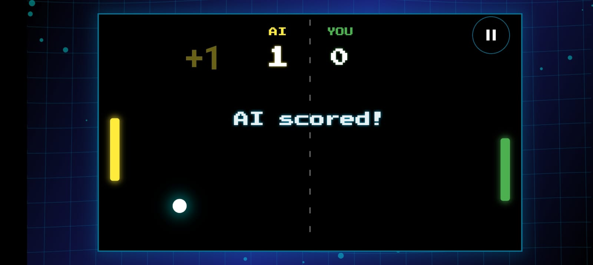
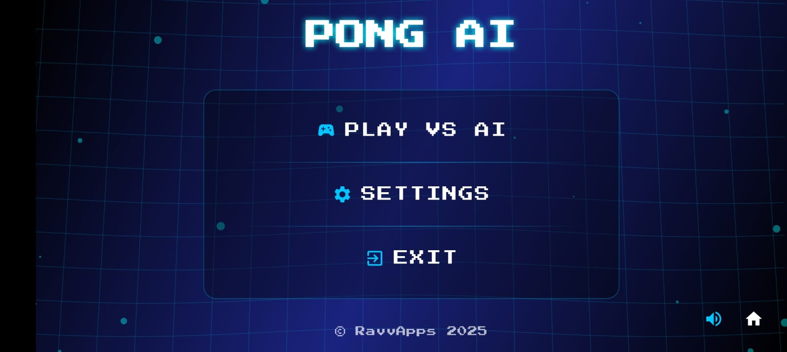
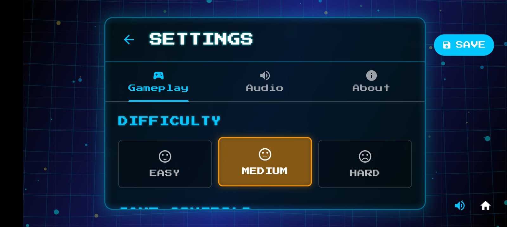
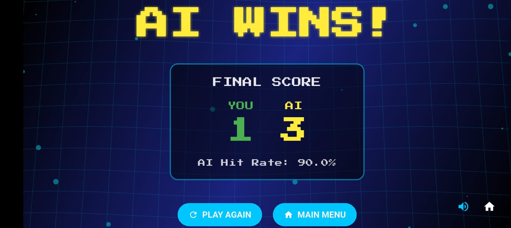
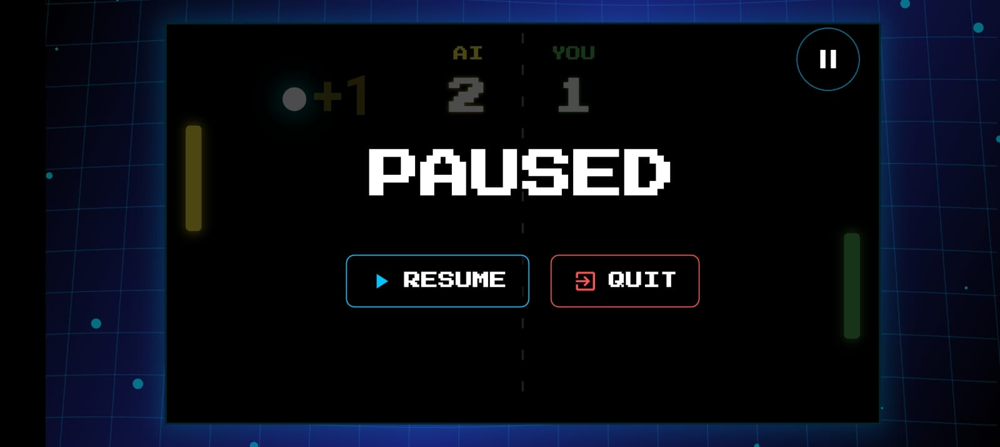
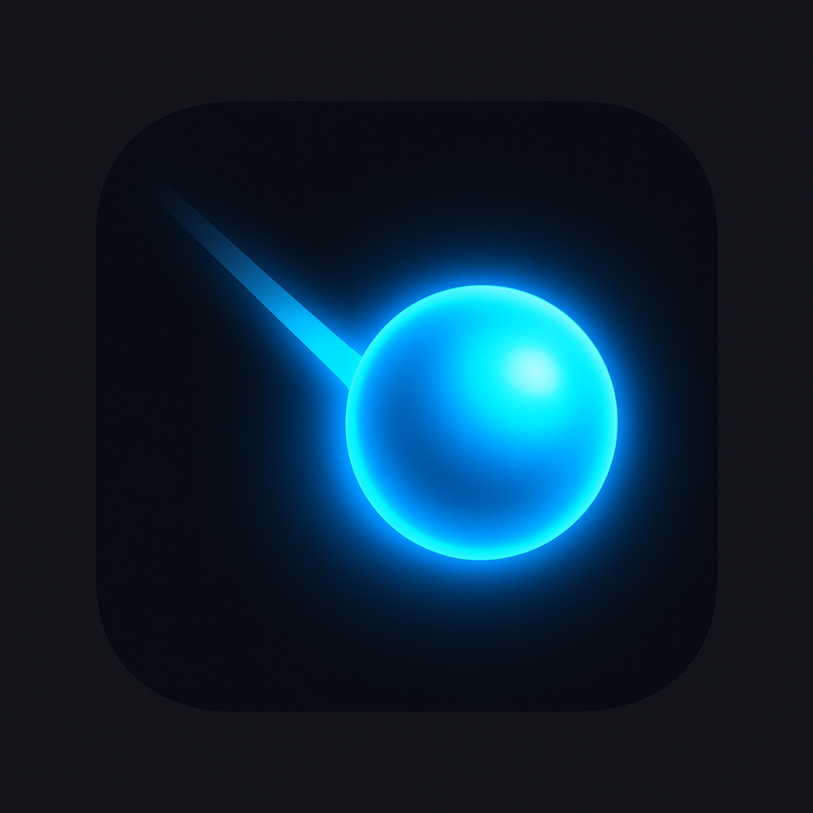

# Pong AI



A modern implementation of the classic Pong game, enhanced with artificial intelligence. Face off against an adaptive AI opponent that responds to your skill level in this retro-futuristic rendition of the iconic arcade game.

## Features

- **Adaptive AI opponent** that adjusts its difficulty based on your play style
- **Multiple difficulty levels**: Easy, Medium, and Hard
- **Customizable settings** for paddle sensitivity and ball speed
- **Real-time particle effects** and visual feedback
- **Responsive sound effects** for an immersive gaming experience
- **Arcade-style scoring system** with visual effects
- **Cross-platform compatibility** on mobile, web, and desktop
- **Neon-retro visual style** that pays homage to classic arcade games

## Screenshots

<table>
  <tr>
    <td></td>
    <td></td>
    <td></td>
  </tr>
  <tr>
    <td></td>
    <td></td>
    <td></td>
  </tr>
</table>

## Technology Stack

- **Flutter** for cross-platform UI development
- **Provider** for state management
- **Flutter Animate** for smooth animations
- **AudioPlayers** package for sound effects
- **Custom physics implementation** for realistic ball movement
- **Machine learning model** for AI opponent behavior (TensorFlow Lite)

## Installation

### Prerequisites

- Flutter SDK (latest stable version)
- Dart SDK
- Android Studio / Xcode (for mobile deployment)

### Setup

1. Clone the repository:
   ```bash
   git clone https://github.com/gauravvjhaa/pong-ai.git
   cd pong-ai
   ```

2. Get dependencies:
   ```bash
   flutter pub get
   ```

3. Run the app:
   ```bash
   flutter run
   ```

## How to Play

1. **Main Menu**: Select 'Play' to start a new game.
2. **Controls**:
    - **Mobile**: Touch and drag on the screen to move your paddle
    - **Desktop**: Use arrow keys (Up/Down) or W/S keys to move your paddle
    - **Double Tap/ESC/P**: Pause the game
3. **Objective**: Score points by getting the ball past the AI's paddle.
4. **Game End**: First to reach 3 points wins the match.
5. **Tips**:
    - Hit the ball with the edge of your paddle to increase its speed
    - The "sweet spot" in the center of the paddle provides more control
    - Adjust paddle sensitivity in settings based on your preference

## Settings

- **Difficulty Levels**:
    - **Easy**: AI makes more errors and moves slower
    - **Medium**: Balanced AI with moderate response time
    - **Hard**: AI predicts ball movement with high accuracy

- **Customizations**:
    - Adjust paddle sensitivity to control responsiveness
    - Modify ball speed to change game pace
    - Toggle sound effects and music
    - Enable/disable AI debug info for insights into the AI's decision-making

## Development

### Project Structure

```
lib/
├── main.dart              # App entry point and state management
├── ui/                    # UI screens
│   ├── menu_screen.dart   # Main menu UI
│   ├── game_screen.dart   # Game screen with core gameplay
│   ├── settings_screen.dart # Settings UI
│   └── game_over_screen.dart # Game over screen
├── game/                  # Game logic
│   └── pong_game.dart     # Core game physics
├── ai/                    # AI implementation
│   ├── model_loader.dart  # ML model loading
│   └── ai_player.dart     # AI player logic
└── utils/                 # Helper utilities
```

### Building for Production

```bash
# Android
flutter build apk --release

# iOS
flutter build ios --release

# Web
flutter build web --release
```

## License

This project is licensed under the MIT License - see the [LICENSE](LICENSE) file for details.

## Credits

- Game design and development by [Gaurav Jha](https://github.com/gauravvjhaa)
- Sound effects from [freesound.org](https://freesound.org)
- Inspired by the original Pong game by Atari

## Contributing

Contributions are welcome! Please feel free to submit a Pull Request.

1. Fork the repository
2. Create your feature branch (`git checkout -b feature/amazing-feature`)
3. Commit your changes (`git commit -m 'Add some amazing feature'`)
4. Push to the branch (`git push origin feature/amazing-feature`)
5. Open a Pull Request

---

*Last updated: 2025-04-27 07:21:25*

© 2025 gauravvjhaa